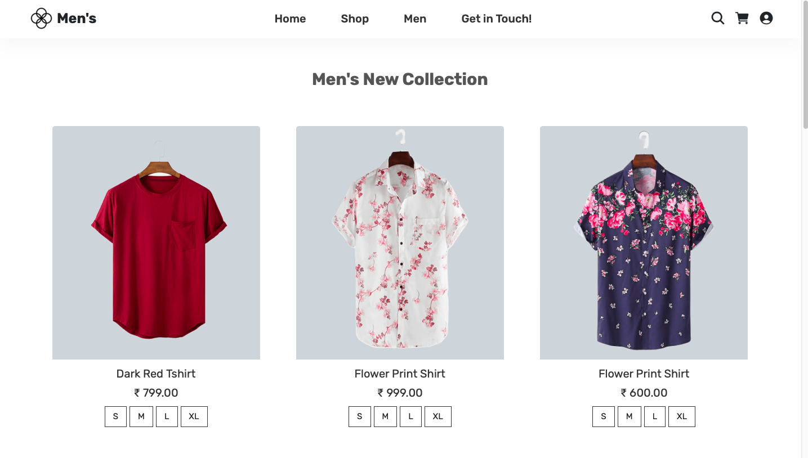

  
  
  
  
   
  <h2 align="center">Responsiv Man's Clothing Website</h2>

  <a href="https://anillkunda.github.io/e-comm_design/"><strong>➥ Live Demo</strong></a>
  

### Demo Screeshots

## 🔥 Some key features of this effort include:

- 📱 Functional mobile navigation button
- 💻 Compatibility across all devices - mobiles, tablets, and laptops
- 🎨 A beautiful and user-friendly interface

## 👨🏻‍💻 Technologies Used

- HTML
- CSS (Flexbox and CSS Grid)
- JavaScript

## Contact
Connect with me on LinkedIn : [Anil Kunda ↗](https://www.linkedin.com/in/anillkunda/)
